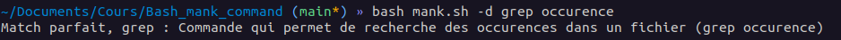
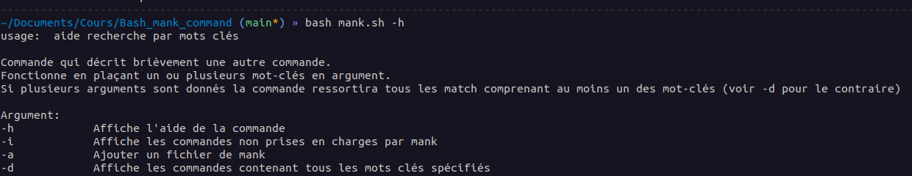
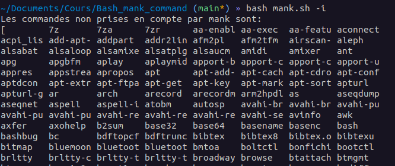
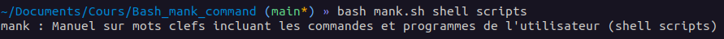
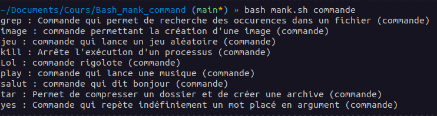

# MANK (Rappel de commande par mots clés)


## Définition des fonctions :
1. **`help()`** : Cette fonction affiche l'aide liée à la commande `mank.sh`, expliquant son utilisation et ses options disponibles.
   
2. **`Liste_Fichier()`** : Cette fonction liste les fichiers dans un répertoire spécifié. Elle est utilisée pour lister les fichiers de mank dans le dossier `mank_utils`.

3. **`commande_manquante()`** : Cette fonction affiche les commandes non prises en charge par `mank.sh`, en comparant les commandes existantes avec celles pour lesquelles aucun fichier de mank n'a été créé.

4. **`ajouter_fichier_mank()`** : Cette fonction permet à l'utilisateur d'ajouter un fichier de mank. Elle lui demande de saisir le nom du fichier, une description, puis les mots-clés un par un, chaque mot-clé étant enregistré sur une ligne distincte dans le fichier de mank.

5. **`parcours_fichier()`** : Cette fonction est le cœur du programme. Elle parcourt tous les fichiers contenus dans `mank_utils` et test la présence du ou des mots-clés dans ces derniers. La fonction **`parcours_fichier_-d()`** test si TOUS les mots clés spécifiés sont liés à la commande. 

### Test des arguments donnés :
Le script vérifie les arguments passés lors de son exécution :
   - Si l'option `-h` est utilisée, il affiche l'aide en appelant la fonction `help()`.
   - Si l'option `-i` est utilisée, il affiche les commandes non prises en charge en appelant la fonction `commande_manquante()`.
   - Si l'option `-a` est utilisée, il permet à l'utilisateur d'ajouter un fichier de mank en appelant la fonction `ajouter_fichier_mank()`.
   - Si des mots-clés sont spécifiés, le programme fait appel à `parcours_fichier()`pour trouver les commandes associées ou non.
   - Si l'option -d est utilisée, le programme fait appel à `parcours_fichier_-d`.
   - Si aucun argument n'est passé, il affiche un message d'erreur demandant à l'utilisateur de saisir un argument et affiche ensuite l'aide en appelant la fonction `help()`.
   - Le programme doit normalement prendre en compte les mots-clés composés de deux mots séparés par un espace.

## Recherche de mots-clés :
1. Si l'utilisateur spécifie des mots-clés en argument lors de l'exécution de `mank.sh`, le script parcourt tous les fichiers de mank dans le dossier `mank_utils`.
2. Pour chaque fichier de mank, il recherche les mots-clés spécifiés.
3. Si un mot-clé correspond à un fichier de mank, le script affiche le nom du fichier et sa description.
4. Si plusieurs mots-clés sont entrés, le programme affichera les commandes associées à au moins 1 de ces mots-clés. Sauf si l'option -d est sélectionnée.

En résumé, le script `mank.sh` permet à l'utilisateur d'ajouter des descriptions de commandes avec des mots-clés associés dans des fichiers de mank, de rechercher ces descriptions en fonction des mots-clés spécifiés, et de voir les commandes non prises en charge.


## Bug report
- Si l'utilisateur spécifie un argumen comme -a et colle des caractères après, le programme plantera ou sortira un message d'erreur de `grep`
### Exemple:
```bash
mank -d654

grep: argument «654» incorrect pour «--directories»
Les arguments valables sont :
  - «read»
  - «recurse»
  - «skip»
Usage : grep [OPTION]... MOTIFS [FICHIER]...
Exécutez « grep --help » pour obtenir des renseignements complémentaires.
grep: argument «654» incorrect pour «--directories»
```


## Authors
Edmond BERNE et Simon ROUGET
- [@Edmondbrn](https://www.github.com/Edmondbrn)
- [@SimonRouget](https://github.com/SimonRouget)


## Gallery







